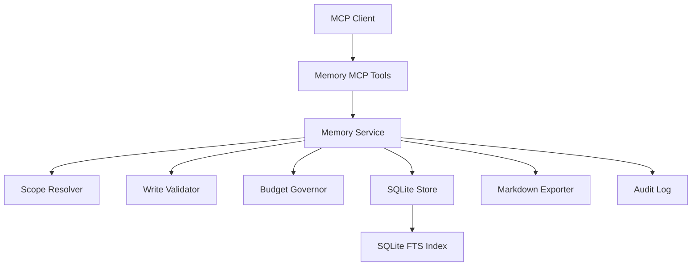

# Local Memory MCP Design

Date: 2026-06-13

## Summary

Build a local-first MCP server that gives coding agents a durable memory service split by global and project scope. Version 1 targets any MCP-compatible coding agent rather than a client-specific integration. It has no model, embedding, or network dependency. It uses direct writes from agents, but every write is governed by strict schema validation, project isolation, capacity budgets, secret screening, and auditable lifecycle events.

The service is best understood as a Memory Ledger plus Search Index plus Budget Governor. It should not try to become a hidden autonomous memory brain. Agents decide what to remember and when to maintain memory; the server enforces structure, isolation, traceability, and hard limits.

## Research Basis

Existing memory systems converge on several useful patterns:

- MCP's reference memory server exposes a simple knowledge-graph memory with entities, relations, observations, search, and deletion. This validates MCP as a stable tool surface for agent memory, but the reference design is too coarse for project-scoped coding experience management.
- Claude Code's project memory uses local plain files, per-project storage derived from repository identity, a concise `MEMORY.md` index, topic files, and user-editable markdown. This is a strong fit for coding agents because humans and agents can inspect and repair memory.
- LangGraph distinguishes short-term thread memory from long-term custom namespaces and describes semantic, episodic, and procedural memory as separate concerns. This maps well to global preferences, project facts, decisions, procedures, debugging lessons, and constraints.
- Mem0's layered model separates conversation, session, user, and organizational memory and exposes MCP tools for add, search, update, delete, event listing, and entity listing. Its strongest lesson for this project is that scope must be explicit on every operation.
- OpenAI's Memory controls and memory sources emphasize user control, correction, deletion, and source visibility. A coding memory service needs the same properties because stale or false memories can directly affect future code changes.
- Recent agent-memory research highlights failure modes in naive memory stores: unbounded growth, stale contradictions, capacity-driven forgetting, and retrieval-only designs. V1 addresses these by making revision, supersession, forgetting, capacity status, and audit events first-class operations.

## Goals

- Provide a local MCP memory service for coding agents.
- Separate global memory from project memory.
- Support direct agent writes without user approval prompts.
- Enforce hard memory budgets so agents must maintain memory hygiene.
- Keep the service usable without external APIs, models, embeddings, or network access.
- Make memory inspectable and repairable through markdown exports.
- Preserve a complete audit trail for create, update, supersede, archive, forget, rejection, and maintenance operations.
- Return source IDs and status metadata with every retrieval so agents can cite, update, or forget the exact memory they used.

## Non-Goals

- No team sharing, authentication, or role-based access in V1.
- No cloud sync in V1.
- No embedding search or LLM-based consolidation in V1.
- No automatic deletion of active memory when over budget.
- No opaque auto-memory pipeline that silently rewrites memory without explicit tool calls.
- No reliance on any specific MCP client such as Codex, Claude Code, Cursor, or OpenCode.
- No hard purge tool for normal MCP clients in V1. Soft deletion with tombstones is enough for local safety and auditability.

## Confirmed Decisions

- Use case: local single-user coding agent memory.
- Client target: generic MCP clients.
- Intelligence dependency: none. Use SQLite FTS, filters, and deterministic heuristics only.
- Write mode: direct write with constraints. Agents can call `remember`, but the server can reject writes that violate schema, isolation, secret, duplicate, or capacity rules.
- Capacity model: hard budgets by global and project scope. On overflow, return actionable maintenance suggestions instead of auto-deleting entries.
- Source of truth: SQLite. Markdown is a human-readable export derived from SQLite.

## Architecture



### Components

`Scope Resolver`

Resolves `scope=global | project`. Project calls must provide `project_id` or `project_path`. When `project_path` is provided, the service canonicalizes it before lookup or creation. Canonicalization prevents accidental split-brain memory for the same project and prevents cross-project contamination.

`Write Validator`

Validates required fields, enum values, status transitions, source metadata, text size, secret patterns, and project scope. It rejects malformed memory before storage.

`Budget Governor`

Checks write impact against global and project budgets. If a write would exceed a hard limit, it returns `capacity_exceeded` with candidate maintenance actions. It does not silently archive, forget, or merge entries.

`SQLite Store`

The authoritative store for entries, scopes, audit events, and FTS content. SQLite keeps V1 deployable as a single local process with simple backup and inspection.

`Markdown Exporter`

Builds `MEMORY.md` indexes and topic files from SQLite. Exports include memory IDs, status, topic, tags, and short summaries so humans and agents can trace markdown content back to source records. Markdown files are not authoritative in V1.

`Audit Log`

Records all lifecycle events. Audit entries must avoid storing rejected secret text. For secret rejections, store only detection category, field name, and timestamp.

## Storage Layout

Default data root:

```text
~/.local-memory-mcp/
  memory.sqlite
  exports/
    global/
      MEMORY.md
      topics/
        <topic>.md
    projects/
      <project-id>/
        MEMORY.md
        topics/
          <topic>.md
```

The data root must be configurable with an environment variable such as `LOCAL_MEMORY_MCP_HOME`. The configured path must be absolute or home-relative.

Project IDs are stable, filesystem-safe identifiers. For a project path, derive a default ID from the canonical path plus a short hash. The canonical path remains stored in `project_scope`.

## Data Model

### Memory Entry

```ts
type MemoryEntry = {
  id: string
  scope: "global" | "project"
  project_id?: string
  project_path?: string

  type:
    | "preference"
    | "procedure"
    | "fact"
    | "decision"
    | "lesson"
    | "debugging"
    | "constraint"

  topic: string
  title: string
  body: string
  tags: string[]

  source: {
    kind: "user" | "agent" | "tool" | "file" | "command" | "external"
    ref?: string
  }

  importance: 1 | 2 | 3 | 4 | 5
  confidence: 1 | 2 | 3 | 4 | 5
  status: "active" | "archived" | "superseded" | "forgotten"

  created_at: string
  updated_at: string
  last_accessed_at?: string
  access_count: number

  expires_at?: string
  review_after?: string
  supersedes?: string[]
  superseded_by?: string

  token_estimate: number
  char_count: number
}
```

### Type Semantics

- `preference`: user or workflow preferences that should shape future behavior.
- `procedure`: repeatable steps, commands, setup sequences, or operational workflows.
- `fact`: stable project or environment facts.
- `decision`: architectural or product decisions and their rationale.
- `lesson`: reusable experience from a completed task.
- `debugging`: symptoms, root cause, verification command, and applicability notes.
- `constraint`: hard boundaries that should prevent unsafe or wrong behavior.

### Project Scope

```ts
type ProjectScope = {
  project_id: string
  canonical_path: string
  display_name: string
  created_at: string
  updated_at: string
  budget: MemoryBudget
}
```

### Audit Event

```ts
type MemoryAuditEvent = {
  id: string
  memory_id?: string
  scope: "global" | "project"
  project_id?: string
  event:
    | "created"
    | "updated"
    | "archived"
    | "superseded"
    | "forgotten"
    | "write_rejected"
    | "maintenance_run"
    | "markdown_exported"
  reason?: string
  actor: "agent" | "user" | "system"
  metadata: Record<string, unknown>
  created_at: string
}
```

## MCP Tools

### `remember`

Writes one memory entry.

Required input:

- `scope`
- `project_id` or `project_path` when scope is `project`
- `type`
- `topic`
- `title`
- `body`
- `tags`
- `source`
- `importance`
- `confidence`

Optional input:

- `expires_at`
- `review_after`
- `supersedes`

Success response includes `memory_id`, `status`, `budget_after`, and `warnings`.

Failure responses include structured errors such as `invalid_scope`, `invalid_schema`, `secret_detected`, `duplicate_candidate`, or `capacity_exceeded`.

### `search_memories`

Searches memory with FTS and metadata filters.

Input:

- `query`
- `scope`
- `project_id` or `project_path`
- `include_global`
- `type`
- `topic`
- `tags`
- `status`
- `limit`

Default behavior searches only `active` memories. Project searches may include global memory only when `include_global=true`.

Response includes memory summaries, match snippets, match reasons, status, source, and IDs.

### `get_memory`

Reads one complete memory entry by ID. Response includes the current entry, audit summary, and supersession chain.

### `list_memories`

Lists entries with pagination and structured filters. This is intended for maintenance and review rather than relevance search.

### `update_memory`

Updates mutable fields on an active or archived entry:

- `topic`
- `title`
- `body`
- `tags`
- `importance`
- `confidence`
- `expires_at`
- `review_after`
- `status`, only for `active <-> archived`

It cannot update forgotten entries. It writes an audit event for every update.

### `supersede_memory`

Creates or selects a replacement memory and marks one or more old memories as `superseded`.

Input includes old memory IDs, replacement content or replacement ID, and `reason`.

Superseded entries do not appear in default search or context exports.

### `forget_memory`

Soft-deletes a memory by setting status to `forgotten`, clearing retrievable body text, and preserving a tombstone plus audit event. Requires `reason`.

### `get_memory_budget`

Returns usage and limits for a scope:

- active entry count
- active character count
- topic usage
- index export size
- oldest review-due entries
- cleanup candidates

### `maintain_memories`

Runs deterministic maintenance actions selected by the agent:

- `archive_low_value`
- `expire_due`
- `rebuild_markdown_index`
- `vacuum_fts`
- `find_duplicates`

`find_duplicates` returns candidate groups using exact and deterministic near-match rules. It does not merge automatically.

### `export_memory_context`

Builds a bounded markdown context pack for a task.

Input:

- `scope`
- `project_id` or `project_path`
- `query`
- `include_global`
- `budget_chars`
- `types`
- `topics`

Output is markdown with explicit memory IDs and scopes. It must never include forgotten body text. It should prefer high-importance, high-confidence, recent, and query-matching entries.

## Capacity Governance

Default budgets:

```ts
global: {
  max_active_entries: 500,
  max_total_chars: 250_000,
  max_index_chars: 25_000
}

project: {
  max_active_entries: 300,
  max_total_chars: 150_000,
  max_topic_chars: 30_000,
  max_index_chars: 25_000
}
```

The budget check runs before every write. It evaluates:

1. Required schema fields.
2. Legal scope and canonical project path.
3. Secret patterns.
4. Duplicate candidates.
5. Active entry count after write.
6. Active character count after write.
7. Topic character count after write.
8. Markdown index size estimate after write.

When a write exceeds budget, the server returns `capacity_exceeded` and does not write the entry.

Example response:

```json
{
  "error": "capacity_exceeded",
  "scope": "project",
  "budget": {
    "max_active_entries": 300,
    "active_entries": 300
  },
  "candidate_actions": [
    {
      "action": "forget_memory",
      "memory_id": "mem_123",
      "reason": "expired low-importance entry"
    },
    {
      "action": "supersede_memory",
      "memory_ids": ["mem_456", "mem_789"],
      "reason": "duplicate debugging lessons"
    },
    {
      "action": "archive",
      "memory_id": "mem_abc",
      "reason": "stale low-access entry"
    }
  ]
}
```

Cleanup candidates are ranked with deterministic scoring:

```text
cleanup_score =
  low_importance
  + low_confidence
  + stale_review_after
  + expired
  + low_access_count
  + duplicate_title_or_body
  - recent_access
  - user_source_bonus
  - high_importance
```

## Lifecycle Rules

- New entries start as `active` unless explicitly created as `archived`.
- `active` entries count toward primary budgets and default retrieval.
- `archived` entries remain searchable only when requested and do not enter default context exports.
- `superseded` entries preserve history and never enter default context exports.
- `forgotten` entries preserve tombstones and audit metadata but not retrievable body text.
- `purge` is not exposed to normal MCP clients in V1.
- Supersession is preferred over destructive update when a new conclusion invalidates an old one.
- Updates are preferred over new writes when the agent is refining the same memory.

## Secret and Sensitive Data Policy

The server must reject likely secrets before storage. V1 should include deterministic pattern checks for:

- private key blocks
- common API key prefixes
- bearer tokens
- `.env`-style assignments containing secret-like names
- long high-entropy token strings

On rejection, the audit log records only:

- event type `write_rejected`
- reason `secret_detected`
- detected category
- field name
- timestamp

It must not store the rejected secret text.

V1 does not attempt complete PII classification. Instead, it relies on explicit agent instruction and memory type constraints. A future version can add configurable sensitive-data policies.

## Markdown Export

Markdown export exists for inspection and interoperability.

`MEMORY.md` is a concise index:

- scope identity
- budget status
- topic list
- high-importance entries
- review-due entries
- pointers to topic files

Topic files contain grouped entries with memory IDs and summaries. They should not exceed the configured topic and index budgets.

SQLite remains authoritative. V1 does not support editing markdown and syncing changes back into SQLite. If a human edits markdown, the next export may overwrite those changes. The implementation should make this clear in generated file headers.

## Agent Best Practices

Agents using this server should follow these rules:

- At task start, call `export_memory_context` with the current project and task query.
- Do not read the entire memory database.
- Before writing, call `search_memories` for likely duplicates.
- Prefer `update_memory` or `supersede_memory` over adding near-duplicate entries.
- Keep memories atomic. Do not write long task logs.
- Write debugging memories with symptom, root cause, verification command, and applicability condition.
- Keep global memory for cross-project preferences and stable operator habits only.
- Keep project implementation details in project scope.
- When `capacity_exceeded` occurs, maintain memory before retrying the write.

## Testing Strategy

### Schema Tests

- Reject missing required fields.
- Reject invalid enum values.
- Reject project-scoped writes without project identity.
- Reject illegal status transitions.
- Reject updates to forgotten entries.

### Scope Isolation Tests

- Global and project memories with the same topic remain separate.
- Different projects with the same topic remain separate.
- Equivalent project paths resolve to the same canonical project scope.
- Project search does not include global memory unless requested.

### Budget Tests

- Reject writes that exceed active entry count.
- Reject writes that exceed total character count.
- Reject writes that exceed topic character count.
- Reject writes that exceed markdown index estimate.
- Return candidate maintenance actions without mutating state.

### Search Tests

- Default search returns only active memories.
- Explicit status filters can return archived or superseded entries.
- Forgotten entries never return body text.
- Tags, type, topic, and scope filters combine correctly.

### Lifecycle Tests

- Update writes audit events.
- Supersede links old and new memories.
- Forgotten entries release active budget.
- Audit history remains readable after forgetting.

### Security Tests

- Reject common secret patterns.
- Do not store rejected secret text in memory or audit metadata.
- Ensure markdown exports do not include forgotten bodies or rejected content.

### Export Tests

- Markdown export is deterministic and idempotent.
- Generated files include source memory IDs.
- Index files respect configured character budgets.
- Topic file generation handles empty topics and archived entries correctly.

## Implementation Shape

V1 can be implemented as a TypeScript Node.js package:

```text
src/
  index.ts              # MCP stdio entrypoint
  tools/                # MCP tool definitions and handlers
  memory-service.ts     # orchestration
  scope-resolver.ts
  write-validator.ts
  budget-governor.ts
  sqlite-store.ts
  markdown-exporter.ts
  audit-log.ts
  secret-detector.ts
test/
  *.test.ts
docs/
  superpowers/
    specs/
      2026-06-13-local-memory-mcp-design.md
```

This shape is not mandatory, but it gives each unit a clear responsibility and keeps the MCP transport separate from memory logic.

## Deferred Work

- Optional embedding search adapter.
- Optional LLM-assisted consolidation adapter.
- Bidirectional markdown import.
- Team mode with users, permissions, and shared project memory.
- Cloud sync.
- Admin-only hard purge.
- Memory evaluation harness with labeled recall cases.

## References

- MCP reference memory server: https://github.com/modelcontextprotocol/servers/tree/main/src/memory
- Claude Code memory docs: https://code.claude.com/docs/en/memory
- LangGraph memory overview: https://docs.langchain.com/oss/python/concepts/memory
- Mem0 memory types: https://docs.mem0.ai/core-concepts/memory-types
- Mem0 MCP docs: https://docs.mem0.ai/platform/mem0-mcp
- OpenAI Memory FAQ: https://help.openai.com/en/articles/8590148-memory-faq
- Is Agent Memory a Database?: https://arxiv.org/abs/2605.26252
- Infini Memory: https://arxiv.org/abs/2606.10677
