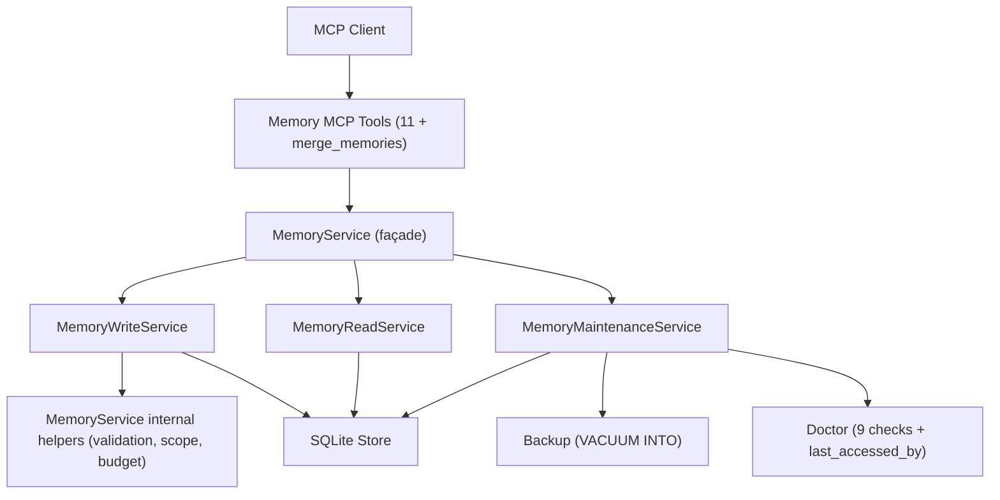

# AgentRecall Stage Two Spec

Date: 2026-07-19

Stage: 2 of 3 in the [2026-07-19 improvement plan](../plans/2026-07-19-agent-recall-improvements.md).

## Summary

Stage 1 shipped the foundation (CLI, doctor, backup, structured `actor`,
schema migration, rewritten tool descriptions). Stage 2 builds on top:
tighter cross-agent hygiene via a `merge_memories` tool and a forced-confirm
flow for `remember` duplicate warnings, plus a one-time refactor of the
`MemoryService` façade so the service stops being a 1100-line god class.

Three things ship:

1. **`merge_memories` MCP tool** — collapse N near-duplicate memories into
   one, mark the others as superseded, all in a single transaction.
2. **Forced-confirm flow for `remember` duplicates** — when an agent
   writes a memory that matches an existing one on title or body, the
   server now requires an explicit `confirm_write: true` to proceed.
   Without it, the write is rejected with `duplicate_candidate` and the
   matching memory IDs.
3. **`MemoryService` façade split** — pure refactor. `MemoryService`
   becomes a thin delegate over `MemoryWriteService`,
   `MemoryReadService`, and `MemoryMaintenanceService`. No behaviour
   change; tests should pass unchanged.

A small bonus lands in this stage too: per-agent `last_accessed_by`
column on `memory_entries`, exposed through a new read-side check in
`doctor`. This is groundwork for stage 3's cross-agent analytics and is
the only schema change in stage 2.

## Background

Stage 1 made the cross-agent story visible: audit rows now carry a
structured `actor` like `agent:claude-code`, doctor reports on actor
distribution, and a v1 → v2 migration is in place. But the
cross-agent *workflow* still has two rough edges:

1. **Two agents writing near-duplicate memories in parallel** is a
   real failure mode. Stage 1 surfaces the duplicate as a soft warning
   in `BudgetAccepted.warnings[]`, but agents in practice ignore
   warnings. We need the duplicate to be a hard reject, with an
   explicit confirm step the agent must take.
2. **Cleaning up after the collision** — once the agent has confirmed
   "yes I knew about the duplicate, write anyway", the next problem is
   two (or more) parallel agents each having their own near-duplicate
   row. The only current tool is `supersede_memory`, which assumes
   exactly one old and one new entry. We need a multi-source merge.

The `MemoryService` refactor is unrelated to the cross-agent story but
unblocks stage 3's analytics work. Doing it in stage 2 (rather than
stage 3) means stage 3 ships a smaller, more focused change.

## Goals

- Agents can call `merge_memories` to collapse N entries into one in
  a single transaction, with a clear strategy knob (`keep_first` /
  `keep_newest`).
- `remember` rejects writes that match an existing active memory on
  title or body unless the caller passes `confirm_write: true`. The
  rejection payload includes the matching memory IDs so the agent
  knows what to do next.
- `MemoryService` becomes a façade; `MemoryWriteService` /
  `MemoryReadService` / `MemoryMaintenanceService` carry the actual
  logic. All existing tests pass unchanged.
- `memory_entries.last_accessed_by` is populated on every read and
  surfaced in `doctor` and `get_memory`.
- `npm test` and `npm run typecheck` stay green. The new test surface
  covers the new behaviour (merge + confirm).

## Non-Goals

- No new embeddings / search algorithms.
- No background-process or auto-merge.
- No undo. Once `merge_memories` runs, the old entries are superseded
  (not forgotten); rollback is by hand via `update_memory` /
  `supersede_memory`.
- No changes to the `recall_context` / `export_memory_context` flow.
- No change to the audit event taxonomy. The new `merge_memories`
  emits `created` (for the new entry) and `superseded` (for each old
  entry), the same as `supersede_memory` does today.
- No new MCP transport. Stdio only.
- No new CLI subcommand. The new MCP tool is exposed through the
  existing MCP server, not as a CLI subcommand in this stage.

## Confirmed Decisions

- **Merge strategy is a per-call parameter**, not a global default.
  Most calls in practice will use `keep_first` (the oldest entry is
  the canonical one; newer duplicates fold into it). `keep_newest` is
  available for "I just want the most recent understanding" cases.
- **The new entry's body is provided by the caller**. We are not
  auto-summarising or auto-merging text. The agent constructs the
  replacement body, then calls `merge_memories` with the candidate
  bodies (or a single replacement body) and the IDs to retire.
  Concretely, the call shape is closest to `supersede_memory`: an
  array of `old_memory_ids` plus a `replacement` object.
- **Forced-confirm is *not* a separate tool**. It is a new
  `confirm_write: boolean` field on the `remember` input. The old
  `remember` call still works — passing `confirm_write: true`
  acknowledges the warning; not passing it (or passing `false`) and
  having a duplicate match results in rejection.
- **Per-agent `last_accessed_by`** is stored as a JSON map
  (`{"claude-code": "2026-07-19T20:00:00.000Z", "cursor": "..."}`) on
  the existing `memory_entries` table, not a separate table. JSON is
  fine because the column is write-once-per-read and the consumer is
  only `doctor` plus a future read tool. A real analytics table
  belongs in stage 3.
- **Façade split keeps `MemoryService` exported** so existing imports
  continue to work. `MemoryService` becomes a class that holds a
  reference to the three sub-services and delegates every public
  method. The constructor signature is unchanged; the only new
  optional parameter is `defaultActor`, which already exists.

## Architecture



The façade split is *not* a layered refactor where the new classes
call each other freely. Each new service depends only on the SQLite
store and the shared validation helpers. The façade forwards calls
without adding behaviour.

## Components

### `merge_memories` MCP tool

Schema (Zod, in `src/tools/schemas.ts`):

```ts
mergeMemoriesInput = {
  scope: "global" | "project",
  project_id?: string,        // required when scope=project
  project_path?: string,      // alternative to project_id
  old_memory_ids: string[],   // 2 <= N
  replacement: {              // remember-shaped object
    type, topic, title, body, tags,
    source, importance, confidence,
    memory_kind?, expires_at?, review_after?
  },
  strategy: "keep_first" | "keep_newest",  // default: "keep_first"
  reason: string                          // free-form, audit-logged
}
```

Behaviour:

1. Validate the input (schema, project identity, ≥ 2 old ids).
2. Resolve scope via `resolveMemoryScope`.
3. Peek all `old_memory_ids`; reject if any is missing, or not in the
   resolved scope, or not in an `active` or `archived` state.
4. Run the existing `prepareRemember` pipeline with the
   `replacement` as the input, **but** exclude the old ids from the
   budget check (so the merge passes the budget even when the
   pre-merge state is at the cap).
5. In a single store transaction:
   a. Insert the replacement (same code path as `remember`).
   b. Update each old entry to `status = "superseded"`,
      `superseded_by = <new id>`, `updated_at = now`.
   c. Append one `created` audit event for the new entry, one
      `superseded` audit event per old entry, and one
      `maintenance_run` event tagged with the merge action.
6. Trigger auto-backup if `changed > 0` (existing hook).

Rejection codes:

- `not_found` — any old id is missing.
- `invalid_schema` — fewer than two old ids, or replacement fails
  write validation.
- `invalid_scope` — old and new entries live in different scopes
  or project ids.
- `invalid_state` — any old entry is `forgotten` or already
  `superseded` by a different new id.

### Forced-confirm flow on `remember`

The `remember` input schema gains a new optional field:

```ts
rememberInput = {
  ...existing fields,
  confirm_write?: boolean   // default: undefined, treated as false
}
```

The `MemoryWriteService.prepareRemember` is modified:

1. Run the existing pipeline up to and including the budget check.
2. If `budget.warnings` contains any `duplicate_candidate`, AND
   `confirm_write !== true`, return `err("duplicate_candidate", ...)`
   with `details.matching_ids: string[]`.
3. Otherwise, proceed as today.

The error code is `duplicate_candidate` (already exported by
`src/actor.ts` and `src/budget-governor.ts`).

The handler in `src/tools/register-tools.ts` propagates the rejection
to the agent unchanged — it's already a structured error, the agent
sees the matching ids and either:

- Calls `search_memories` to look at the duplicates, then
- Calls `remember` again with `confirm_write: true`, OR
- Calls `merge_memories` instead.

### `MemoryService` façade split

Three new files in `src/`:

- `src/services/memory-write-service.ts`
- `src/services/memory-read-service.ts`
- `src/services/memory-maintenance-service.ts`

`src/memory-service.ts` becomes:

```ts
export class MemoryService {
  constructor(
    private readonly write: MemoryWriteService,
    private readonly read: MemoryReadService,
    private readonly maintenance: MemoryMaintenanceService,
    private readonly defaultActor: string = "agent"
  ) {}

  // read
  getMemory(id) { return this.read.getMemory(id); }
  listMemories(filters) { return this.read.listMemories(filters); }
  searchMemories(filters) { return this.read.searchMemories(filters); }
  exportMemoryContext(input) { return this.read.exportMemoryContext(input); }
  getMemoryBudget(input) { return this.read.getMemoryBudget(input); }

  // write
  remember(input) { return this.write.remember(input); }
  updateMemory(id, input) { return this.write.updateMemory(id, input); }
  supersedeMemory(input) { return this.write.supersedeMemory(input); }
  forgetMemory(id, reason) { return this.write.forgetMemory(id, reason); }
  mergeMemories(input) { return this.write.mergeMemories(input); }

  // maintenance
  maintainMemories(input) { return this.maintenance.maintainMemories(input); }
  backup() { return this.maintenance.backup(); }
}
```

A new factory `createMemoryService(store, exporter, dataHome)` in
`src/services/memory-service-factory.ts` wires the three sub-services
together. `createService()` in `src/index.ts` calls this factory
instead of constructing `MemoryService` directly.

The internal helpers that today live as private methods on
`MemoryService` (`buildEntry`, `appendAudit`, `auditRejected`,
`evaluateWriteRate`, `memoryKindPolicy`, `evaluateEntryBudget`,
`budgetFor`, `activeEntriesFor`, `usageFromActiveEntries`,
`ensureProjectScope`, `expiresAtFor`) move to a new
`src/services/memory-service-helpers.ts` module. They are pure
functions of the store + budget + entry, so they can be called from
both `MemoryWriteService` and `MemoryMaintenanceService` without
duplication.

### `last_accessed_by` column

Schema:

```sql
ALTER TABLE memory_entries ADD COLUMN last_accessed_by TEXT;  -- JSON map
```

This is migration `v2 → v3`. `CURRENT_SCHEMA_VERSION` becomes `3`.

The new `migrate_v2_to_v3()` adds the column. Backfill is not needed
because the column is nullable and the read path always handles
"missing → empty map".

Updates to the read path:

- `SQLiteMemoryStore.getEntry` already updates `last_accessed_at` and
  `access_count`. It also needs to read the agent name from the
  actor passed in. The cleanest split: `getEntry` accepts an optional
  `accessedBy: string` parameter; if provided, it updates
  `last_accessed_by` with the agent name and current timestamp.
  The MCP handler always provides it; tests provide it when they
  want the column updated.
- `SQLiteMemoryStore.searchEntries` does not bump `access_count` today
  (search is read-only by design). The new column is not touched on
  search.

Updates to the write path:

- `decodeEntry` reads `last_accessed_by` (JSON → `Record<string, string>`)
  and exposes it as `last_accessed_by?: Record<string, string>` on
  `MemoryEntry`.

Updates to `doctor`:

- New check `last_accessed_by` reports how many entries have a
  non-empty `last_accessed_by` map, and lists the agents seen. Status
  is `ok` for any value. This pushes the doctor check count from
  nine to ten.

## Storage Layout

`memory_entries` table gains one column:

| Column | Type | Notes |
|---|---|---|
| `last_accessed_by` | TEXT (JSON) | `Record<agent_name, ISO timestamp>` |

No index changes. The JSON column is not searched; it is read by id
only.

## Data Model

`MemoryEntry` gains an optional field:

```ts
type MemoryEntry = {
  ...existing fields,
  last_accessed_by?: Record<string, string>
};
```

No other types change. The audit event name union is unchanged; the
new `merge_memories` operation reuses `created` and `superseded` as
documented in the spec.

## API

### `merge_memories`

| Output | Type | Notes |
|---|---|---|
| success | `{ memory_id: string, merged_from: string[] }` | The new entry's id and the list of old ids now in `superseded` status |
| `not_found` | `{ memory_id: string }` | In `details` |
| `invalid_schema` | `{ fields: string[] }` | In `details` |
| `invalid_scope` | `{ message }` | |
| `invalid_state` | `{ memory_id, status }` | In `details` for the bad entry |

### `remember` (modified)

The output shape is unchanged on success. On duplicate match without
`confirm_write: true`, the output is:

```ts
{
  ok: false,
  error: "duplicate_candidate",
  message: "existing active memory has the same title or body; pass confirm_write: true to proceed",
  details: { matching_ids: ["mem_abc", "mem_def"] }
}
```

`details.matching_ids` is the array of `MemoryEntry.id` values that
match on title or body (case-insensitive, whitespace-normalised
comparison, same logic as the existing `sameText` helper in
`src/budget-governor.ts`).

## Verification

```bash
npm run typecheck
npm test
git diff --check
node dist/bin/agent-recall.js doctor
```

The new test surface covers:

- `merge_memories` happy path: 2 entries + replacement → 1 new
  entry, 2 superseded, audit chain has `created` + 2 `superseded`.
- `merge_memories` rejection paths: 1 old id (too few), missing id,
  cross-scope replacement, `forgotten` source entry.
- `merge_memories` budget relaxation: a memory at 500/500 max
  entries + 1 replacement + 2 old ids should succeed.
- `remember` reject path: 2 memories with the same title, second
  `remember` without `confirm_write` is rejected.
- `remember` confirm path: same setup, second `remember` with
  `confirm_write: true` succeeds.
- `last_accessed_by` round-trip: insert, read, verify JSON map.
- `last_accessed_by` doctor check: 10th check appears and reports.
- Façade split: every existing test passes unchanged.

## Open Questions

1. **`merge_memories` strategy `keep_newest` semantics**: should the
   new entry's `created_at` be `now`, or the most recent old entry's
   `created_at`? Plan assumption: `now`, because the new entry is
   genuinely new content. Confirm before implementing.
2. **`last_accessed_by` cardinality**: should we cap the map at N
   agents to prevent unbounded growth? Plan assumption: no cap in
   stage 2; revisit in stage 3 if the column bloats.
3. **Façade naming**: `MemoryService` → façade; sub-services live in
   `src/services/`. Alternative: keep the existing single class but
   extract the maintenance logic only. Plan assumption: full
   three-way split, because the write service is the natural home
   for the new `merge_memories` and forced-confirm logic.

## Out of Scope (Stage 3+)

- Maintenance operation chunking / off-lock-path
- PII detection in `secret-detector.ts`
- Markdown export format switch (`agent_friendly` vs `human_friendly`)
- Soft-conflict detection between high-confidence memories
- Import / backup-restore CLI subcommands
- Per-agent analytics dashboards (a real cross-agent view in
  `recall_context` / `export_memory_context`)
